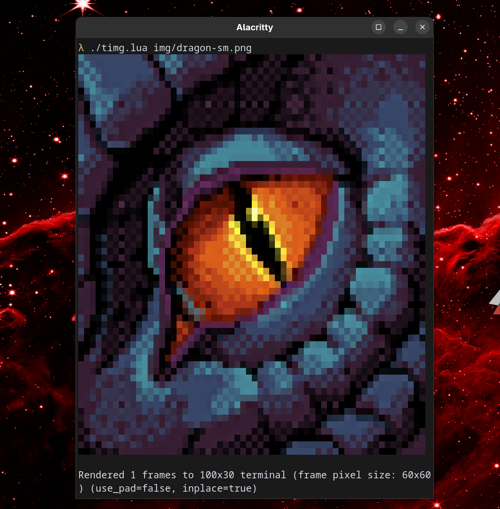

# Timg

Renders images/video to the terminal using `ffmpeg` -> raw RGBA -> Unicode half-blocks (▀) with 24-bit color.


> Screenshot of an image rendered to the terminal
> 
> Image credit [craftyglitch](https://www.deviantart.com/craftyglitch/art/Dragon-Pixel-art-926569066)

## Features
- Supports LuaJIT
- Terminal agnostic 
    - Rendered with Unicode & ANSI escape sequences
- Shows images
- Plays videos
    - For some reason
- Neovim integration

> [!TIP] 
> This also provides a Neovim plugin to display images/videos in a floating terminal using the `Timg ...` command.

## Requires
- `ffmpeg`
- `lua` or `luajit`
- 24-bit color terminal emulator

# Usage

Run directly:
```sh
lua timg.lua <input-file-or--> [width_cols] [fps] [mode]
```

Arguments:
```
<input-file-or-> : path to input image or video file, or '-' to read from stdin
[width_cols]     : optional target width in character columns (default: terminal width)
[fps]            : optional target frames per second for video input (default: 15)
[mode]           : optional mode flag; pass "-i", "--inline" or "inline" to disable in-place overwrite mode
```

> [!NOTE] 
> It is also possible to use a path relative to your current working directory.

> [!WARNING]
> Terminals cannot actually show more character columns than their real width; if you provide a very large `width_cols` that exceeds your terminal's real column count, the output may wrap/clip in your terminal.
> If you want to display a wider image you must resize the terminal emulator or use a different display target.

Example:
```sh
lua timg.lua image.png
lua timg.lua video.mp4 80 16 -i
lua timg.lua - # read input from stdin (no probing available; will fall back to terminal-height behavior)
```

## Neovim

> [!WARNING] 
> This isn't really set up as a proper plugin yet. 

To use it: 
1. Place `timg.lua` and `timgnvim.lua` in your nvim config somewhere like `/lua/apps/timg`. 
2. Edit `timgnvim.lua` to ensure the path to `timg.lua` is correct.
3. Edit your `init.lua` file to require `timgnvim`. 

You should now be able to use the `:Timg ...` command which takes the exact same parameters as the `timg.lua` script.

> [!NOTE]  
> Its not easily possible to render something like this directly in a Neovim buffer, so we use a terminal window as a workaround.

